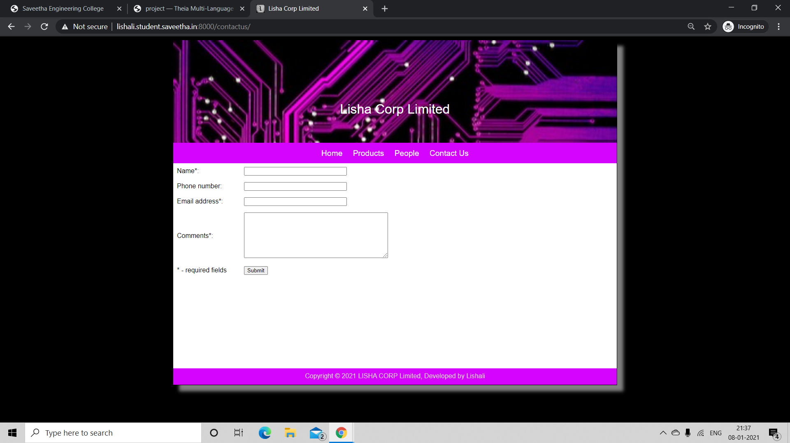
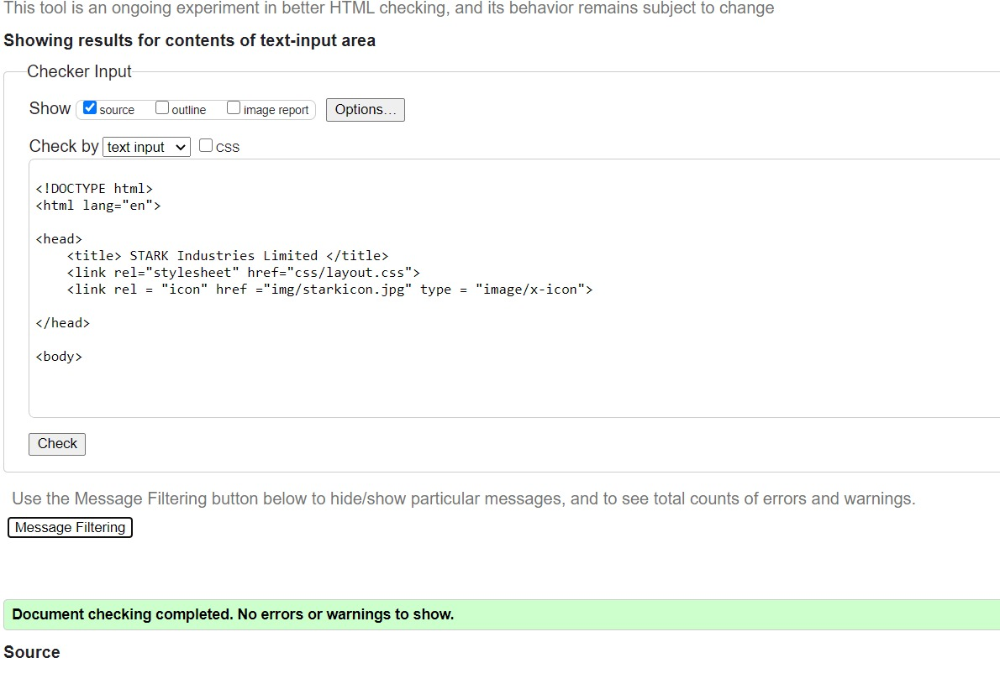
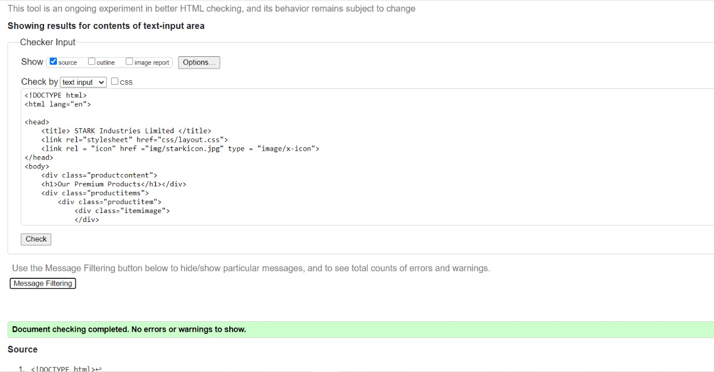

# Web Design for a Manufacturing Company
## AIM: 
To design a static website for a chip manufacturing company.

## DESIGN STEPS:
### Step 1: 
Requirement collection.
### Step 2:
Creating the layout using HTML and CSS.
### Step 3:
Updating the sample content.
### Step 4:
Choose the appropriate style and color scheme.
### Step 5:
Validate the layout in various browsers.
### Step 6:
Validate the HTML code.
### Step 6:
Publish the website in the given URL.

## PROGRAM:

### base.html
```

<!DOCTYPE html>
<html lang="en">

<head>
    <title> Lisha Corp Limited </title>
    <link rel="stylesheet" href="">
    <link rel = "icon" href ="" type = "image/x-icon"> 
              
</head>

<body>
    <div class="container">
    <div class="banner">
        Lisha Corp Limited
    </div>
    <div class="menu">
        <div class="menuitem"><a href="/home">Home</a></div> 
        <div class="menuitem"><a href="/products">Products</a></div> 
        <div class="menuitem"><a href="/people">People</a></div>
        <div class="menuitem"><a href="/contactus">Contact Us</a></div> 
    </div><div class="content">
        
    
    </div>
    <div class="footer">
        Copyright © 2021 LISHA CORP Limited, Developed by Lishali
    </div>
    </div>
</body>

</html>
```
### home.html
```



    <div class="homecontent">    
    <h1>About Us</h1>
    
    <div class="contenttext">
    Lishali Corp Pvt Ltd, provides a broad range of semiconductor and infrastructure software applications that serve the data center, networking, software, broadband, wireless, and storage and industrial markets. Common applications for its products include: data center networking, home connectivity, broadband access, telecommunications equipment, smartphones, base stations, data center servers and storage, factory automation, power generation and alternative energy systems, displays, and mainframe operations and management, and application software development. Some of Silicon's core technologies and products include:
    <ul>
        <li>Memory Chips</li>
        <li>SATA HDD</li>
        <li>SATA SSD </li>
        <li>Broadband Modems</li>
        <li>Wifi Devices</li>
        <li>Switching Devices</li>
        <li>Optical Sensors</li>
    </ul> 
    </div>
    </div>


```
### products.html
```



    <div class="productcontent">    
    <h1>Our Premium Products</h1>
    <div class="productitems">
        <div class="productitem"> 
            <div class="itemimage">
            
            </div>
            <div class="itemname">seagate 1 TB 3.5" internal hard drive</div>
            <div class="itemprice">Price: Rs.3600.00 </div>
        </div>
        <div class="productitem"> 
            <div class="itemimage">
            
            </div>
            <div class="itemname">ASRock B4500M steel legend socket AM4</div>
            <div class="itemprice">Price: Rs.8000.00 </div>
        </div>
        <div class="productitem"> 
            <div class="itemimage">
            
            </div>
            <div class="itemname">Intel core i7 processor</div>
            <div class="itemprice">Price: Rs.24000.00 </div>
        </div>
        <div class="productitem"> 
            <div class="itemimage">
            
            </div>
            <div class="itemname">HyperX Fury 8GB 3200MHZ DDR4</div>
            <div class="itemprice">Price: Rs.2000.00 </div>
        </div>
        <div class="productitem"> 
            <div class="itemimage">
            
            </div>
            <div class="itemname">ultra slim glare full LED HD monitor</div>
            <div class="itemprice">Price: Rs.8500.00 </div>
        </div>
        <div class="productitem"> 
            <div class="itemimage">
            
            </div>
            <div class="itemname">floppy</div>
            <div class="itemprice">Price: Rs.1500.00 </div>
        </div>
        <div class="productitem"> 
            <div class="itemimage">
            
            </div>
            <div class="itemname">graphic card</div>
            <div class="itemprice">Price: Rs.25000.00 </div>
        </div>
        <div class="productitem"> 
            <div class="itemimage">
            
            </div>
            <div class="itemname">Headset</div>
            <div class="itemprice">Price: Rs.1000.00 </div>
        </div>
        <div class="productitem"> 
            <div class="itemimage">
            
            </div>
            <div class="itemname">Dell Km117 Wireless keyboard mouse</div>
            <div class="itemprice">Price: Rs.2000.00 </div>
        </div>
        <div class="productitem"> 
            <div class="itemimage">
            
            </div>
            <div class="itemname">Asus Zenbook 14 UX425JA-HM021T</div>
            <div class="itemprice">Price: Rs.81000.00 </div>
        </div>
        <div class="productitem"> 
            <div class="itemimage">
            
            </div>
            <div class="itemname">HP pendrive 32 GB</div>
            <div class="itemprice">Price: Rs.1500.00 </div>
        </div>
        <div class="productitem"> 
            <div class="itemimage">
            
            </div>
            <div class="itemname">intel i9 9900k processor</div>
            <div class="itemprice">Price: Rs.36000.00 </div>
        </div>
    </div>
    </div>

```
### people.html
```



<div class="peoplecontent">
    <h1>Our Crew</h1>
    <div class="crewmembers">
        <div class="crewmember">
            <div class="memberimage">
                
            </div>
            <div class="membername">LISHALI</div>
            <div class="designation">C.E.O LISHA CORP</div>
        </div>
        <div class="crewmember">
            <div class="memberimage">
                
            </div>
            <div class="membername">JAYASHREE</div>
            <div class="designation">FRONTEND DEV</div>
        </div>
        <div class="crewmember">
            <div class="memberimage">
                
            </div>
            <div class="membername">ARUN</div>
            <div class="designation">TECHNICAL TEAM</div>
        </div>
        <div class="crewmember">
            <div class="memberimage">
                
            </div>
            <div class="membername">CHETAN</div>
            <div class="designation"> R & D HEAD </div>
        </div>
        <div class="crewmember">
            <div class="memberimage">
                
            </div>
            <div class="membername">PRASHEETHA</div>
            <div class="designation"> DESIGN TEAM </div>
        </div>
        <div class="crewmember">
            <div class="memberimage">
                
            </div>
            <div class="membername">AAKASH</div>
            <div class="designation"> MARKETING HEAD </div>
        </div>
    </div>
    
    ```
    ### contactus.html
    ```
    


<form action="//submit.form" id="ContactUs100" method="post" onsubmit="return ValidateForm(this);">
<script type="text/javascript">
function ValidateForm(frm) {
if (frm.Name.value == "") { alert('Name is required.'); frm.Name.focus(); return false; }
if (frm.FromEmailAddress.value == "") { alert('Email address is required.'); frm.FromEmailAddress.focus(); return false; }
if (frm.FromEmailAddress.value.indexOf("@") < 1 || frm.FromEmailAddress.value.indexOf(".") < 1) { alert('Please enter a valid email address.'); frm.FromEmailAddress.focus(); return false; }
if (frm.Comments.value == "") { alert('Please enter comments or questions.'); frm.Comments.focus(); return false; }
return true; }
</script>
<table style="width:100%;max-width:550px;border:0;" cellpadding="8" cellspacing="0">
<tr> <td>
<label for="Name">Name*:</label>
</td> <td>
<input name="Name" type="text" maxlength="60" style="width:100%;max-width:250px;" />
</td> </tr> <tr> <td>
<label for="PhoneNumber">Phone number:</label>
</td> <td>
<input name="PhoneNumber" type="text" maxlength="43" style="width:100%;max-width:250px;" />
</td> </tr> <tr> <td>
<label for="FromEmailAddress">Email address*:</label>
</td> <td>
<input name="FromEmailAddress" type="text" maxlength="90" style="width:100%;max-width:250px;" />
</td> </tr> <tr> <td>
<label for="Comments">Comments*:</label>
</td> <td>
<textarea name="Comments" rows="7" cols="40" style="width:100%;max-width:350px;"></textarea>
</td> </tr> <tr> <td>
* - required fields
</td> <td>
<input name="skip_Submit" type="submit" value="Submit" />
</td> </tr>
</table>
</form>

```
  ## output:




## CODE VALIDATION REPORT:







## RESULT:
Thus a website is designed for the chip manufacturing company and is hosted in the URL http://lishali.student.saveetha.in:8000/. HTML code is validated.